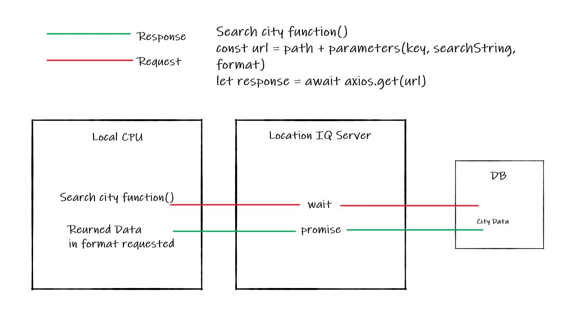

# City Explorer
**Author**: Samuel Panek
**Version**: 1.0.0

## Overview
- Application is to allow the ability to search a city and be able to get some information back about that city.
- This will be done through calls to an API that requires a specific search query to return the correct information from its database.
- This responsed data can be parse and rendered to the page

## Getting Started
- Requirements:
  - [axios installed](https://www.npmjs.com/package/axios#axios-api)
    - `npm install axios`
  - [Access token to LocationIQ](https://my.locationiq.com/)
  - Create a react app
    - `npx create-react-app projectTitle`
  - Have a place to deploy app
    - Suggestion:
      - [Netlify](https://www.netlify.com/)

## Architecture
- Built in:
  - JavaScript
- Uses:
  - React Bootstrap
  - React
  - axios
  - node.js
- Structure:
  - Index component
    - App Component
      - Header Component
      - Main Component
        - Search Bar Component
          - Will communicate to LocationIQ using user-generated search parameters
        - Returned Search Info Component
          - Will use the returned data from LocationIQ to create rest of page
      - Footer Component
- Data Flow Diagram:
- 

## Change Log:
- 01-11-21 3:20pm created base file structure for city-explorer
- 01-11-21 7:09pm finalizes flow for lat and longs
- 01-11-21 9:09pm adds map to card

## Credit and Collaborations
- Brandon Wolf -- Helped define data flow for project
- Joseph Streifel -- Helped identify how to use the image src
- Joseph Streifel -- Helped identify how the error response would come back as

## Time Management
- Name of Feature: Set up Repository
    - Estimate of time needed to complete: 1hr
    - Start Time: 2:20pm
    - Finish Time: 3:43pm
    - Actual time needed to complete: 1hr 23mins

- Name of Feature: Locations
    - Estimate of time needed to complete: 30mins
    - Start Time: 3:50pm
    - Finish Time: 7:06pm
    - Actual time needed to complete: 3hrs with an hour dinner

- Name of Feature: Map
    - Estimate of time needed to complete: 1hr
    - Start Time: 7:09pm
    - Finish Time: 9:33pm
    - Actual time needed to complete: 2hr 24min

- Name of Feature: Error
    - Estimate of time needed to complete: 1hr
    - Start Time: 9:35pm
    - Finish Time: 10:23pm
    - Actual time needed to complete: 48min